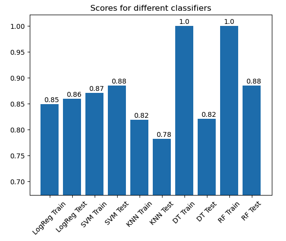

# classification-mini-project

This project works to create a miniscule pipeline to run multiple classification algorithms at once and plot the scores of those in a bar graph. Helps to speeden lower level EDA.

The algorithms being used are:
* Logistic regression

* Support vector machine (SVM)
  
* K-nearest neighbor (KNN)

* Decision tree classifier

* Random forest classifier

* The following are implemented but commented out.
  - Extremely random trees classifier

  - Gradient boosting classifier

  -  Adaptive boosting (AdaBoost) classifier

The datasets are available at the links in the references.

## Output:

## References
* Iranian Churn Dataset. 2020. UCI Machine Learning Repository. Available: https://archive.ics.uci.edu/dataset/563/iranian+churn+dataset [2023, September 20]. (CC-BY 4.0)

* Slate, D. 1991. Letter Recognition. UCI Machine Learning Repository. Available: https://archive.ics.uci.edu/dataset/59/letter+recognition [2023, September 25]. (CC-BY 4.0)

* Rizk,Y. & Awad, M. 2018. Sports articles for objectivity analysis. UCI Machine Learning Repository. Available: https://archive.ics.uci.edu/dataset/450/sports+articles+for+objectivity+analysis [2023, September 27]. (CC-BY 4.0)

* Abdelhamid, N. 2016. Website Phishing. UCI Machine Learning Repository. Available: https://archive.ics.uci.edu/dataset/379/website+phishing [2023, September 25]. (CC-BY 4.0)

* Barreto, G. & Neto, A. 2011. Vertebral Column. UCI Machine Learning Repository. Available: https://archive.ics.uci.edu/dataset/212/vertebral+column [2023, September 25]. (CC-BY 4.0)